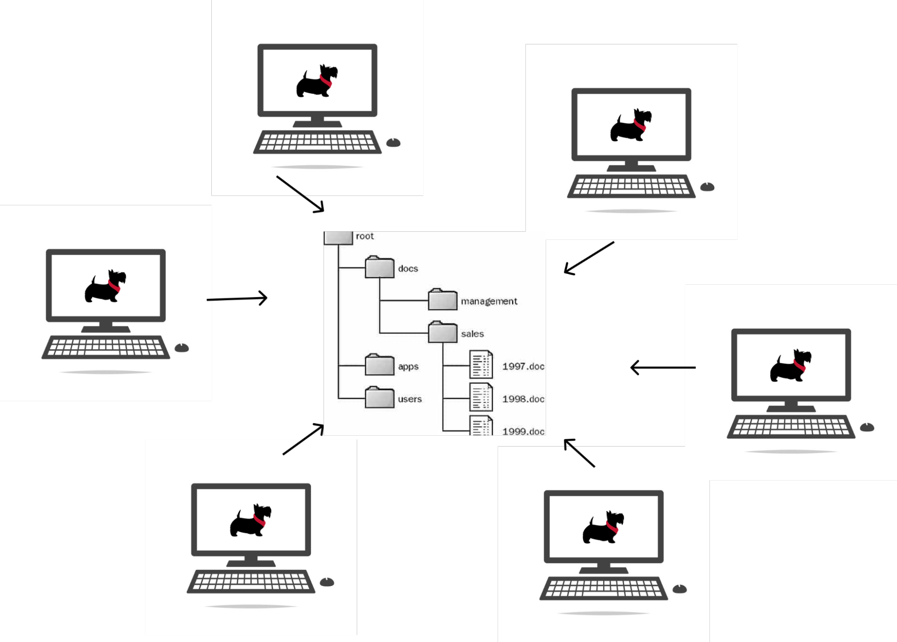

# AFS Overview

Imagine a file system similar to the one on your personal computer, except all students and faculty of Carnegie Mellon University can create, access and edit files on the system. That describes the Andrew FIle System in a nutshell - a global file system that allows access to files from Mac, Windows or Linux computers. 

Unlike cloud storage, the data is stored locally at Carnegie Mellon University and accessed via trusted remote servers.

Here's a visual depction of what's going on:  

<figure class="aligncenter">
    
</figure>

**SSH** is a secure way for your computer to access an AFS remote host.
