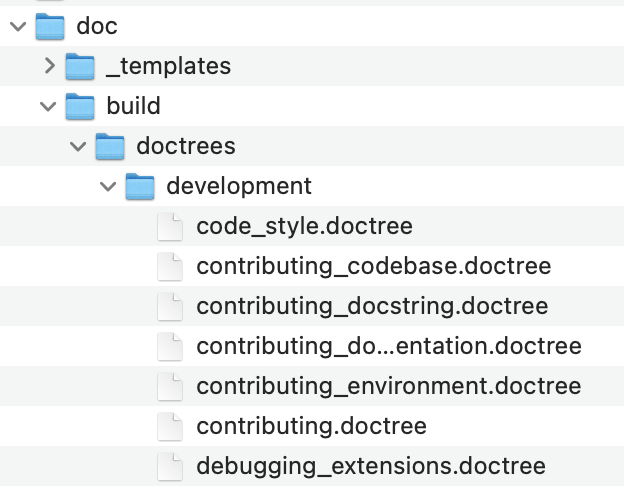

# File Paths

A file path is a way to specify the location of a file within a file system.

For example:




If you are currently located in the `doc` directory, to get the file path to `code_style.doctree`, the desired filepath would be:

```
./build/doctrees/development/code_style.doctree
```


## Helpful commands

Use `pwd` in your current directory to get your current file path.

`.` specifies the current directory in your file path.

`..` lets you 'go backwards' a directory in your file path. 

On most operating systems, you can use your file navigator (i.e, File Explorer on Windows) to get the file path of a file. Typically you can right-click the file and there will be an option for 'more info' that will list the desired file path.