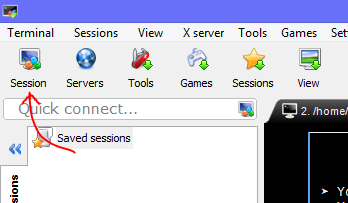
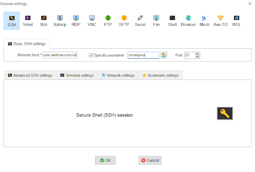

# Setting up SSH on your computer
## Windows

 

You can either use [Windows Subsystem for Linux](https://docs.microsoft.com/en-us/windows/wsl/) or [MobaXterm(recommended)](https://mobaxterm.mobatek.net/) as your terminal. The instructions for setup and use of **MobaXterm** are detailed below. If you use WSL, feel free to skep the following instructions.

 

1. Download and Install the Installer edition of MobaXterm [here](https://mobaxterm.mobatek.net/download-home-edition.html).
2. Open the application to see a prompt where you can directly SSH like you would do on a normal Mac terminal.

<figure class="aligncenter">
    
</figure>

   The terminal will prompt you to enter your password - use the same password you use to log onto WebISO

3. **Save Session (optional)**: If you don’t want to type out your username and hostname every time you SSH into AFS, you can ‘Save Session’. Click the ‘Save session’ button at the top left corner of the MobaXterm window.

<figure class="aligncenter">
    
</figure>

  This will open up a window where you can save your SSH session settings. As indicated by the image below, the fields and values you’ll need to populate are:
  - **Remote host: unix.andrew.cmu.edu**
  - **Specify username: check the box, then `your_andrewID`**
  - **Port: 22**

<figure class="aligncenter">
    
</figure>

